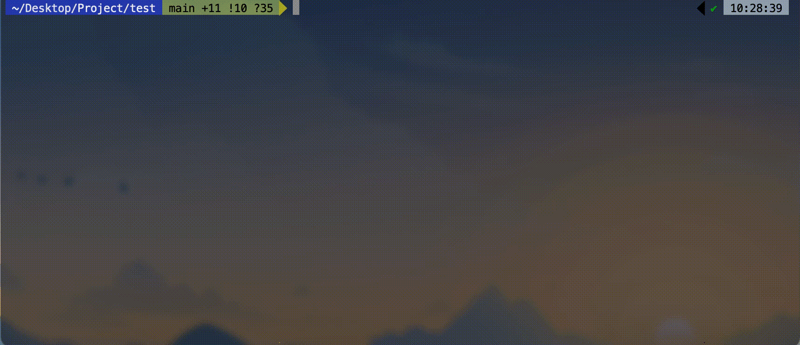

 

  <h3 align="center">
    Project Command Line Tool
</h3>
    

      A comfortable tools to start your projects!
       
      <a href=""><strong>Explore the docs >></strong></a>
    

</h3>

  
Table of Contents

  <ol>
    <li>
      <a href="#about-the-project">About The Project</a>
      <ul>
        <li><a href="#built-with">Built With</a></li>
      </ul>
    </li>
    <li>
      <a href="#getting-started">Getting Started</a>
      <ul>
        <li><a href="#prerequisites">Prerequisites</a></li>
        <li><a href="#installation">Installation</a></li>
      </ul>
    </li>
    <li><a href="#usage">Usage</a></li>
  </ol>

<!-- ABOUT THE PROJECT -->

## About The Project

This project is a tool for creating projects.

## Usage

This paragraph explains how to use this program.

### Viewing project template list

